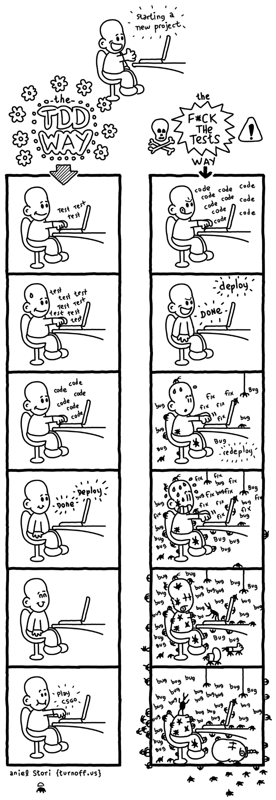

# In Tests We Trust — TDD with Python

Unit tests are some pieces of code to exercise the input, the output and the behaviour of your code. You can write them anytime you want.

Be ok with the possibility of the beginning to be hard sometimes — and it’s totally fine. Really.

The test file name should follow the same name of module name. For instance, if our module is gender.py, our test name should be test_gender.py. It’s ideal to separate the tests folder from production code (the implementation) and to have something like this:

```
mymodule/
 — module.py
 — another_folder/
 — — another_module.py
tests/
 — test_module.py
 — another_folder/
 — — test_another_module.py
 ```

 ### The "test driven development" cycle is made by three steps:
 ...

🆘 Write a unit test and make it fail (it needs to fail because the feature isn’t there, right? If this test passes, call the Ghostbusters, really)
✅ Write the feature and make the test pass! (you can dance after that)
🔵 Refactor the code — the first version doesn’t need to be the beautiful one (don’t be shy)
Using baby steps you can go through this cycle every time you add or modify a new feature in your code.

Just build what is needed to make the test pass. When we are writing tests we are forced to think about the design first and how we can break it into small pieces.

The greatest advantage about TDD is to craft the software design first
Your code will be more reliable: after a change you can run your tests and be in peace
Beginning may be hard — and that’s fine. You just need to practice!

...



...

[In Tests We Trust](https://code.likeagirl.io/in-tests-we-trust-tdd-with-python-af69f47e6932)

# Recursion

### What is Recursion? 

The process in which a function calls itself directly or indirectly is called recursion and the corresponding function is called as recursive function. Using recursive algorithm, certain problems can be solved quite easily. Examples of such problems are Towers of Hanoi (TOH), Inorder/Preorder/Postorder Tree Traversals, DFS of Graph, etc.

### How is a particular problem solved using recursion? 

The idea is to represent a problem in terms of one or more smaller problems, and add one or more base conditions that stop the recursion. For example, we compute factorial n if we know factorial of (n-1). The base case for factorial would be n = 0. We return 1 when n = 0. 

### What is the difference between direct and indirect recursion? 

A function fun is called direct recursive if it calls the same function fun. A function fun is called indirect recursive if it calls another function say fun_new and fun_new calls fun directly or indirectly. Difference between direct and indirect recursion has been illustrated in Table 1. 

```
// An example of direct recursion
void directRecFun()
{
    // Some code....

    directRecFun();

    // Some code...
}

// An example of indirect recursion
void indirectRecFun1()
{
    // Some code...

    indirectRecFun2();

    // Some code...
}
void indirectRecFun2()
{
    // Some code...

    indirectRecFun1();

    // Some code...
}
```
...

[Recursion](https://www.geeksforgeeks.org/recursion/)
    


 [<----- Back to About Me](../README.md)